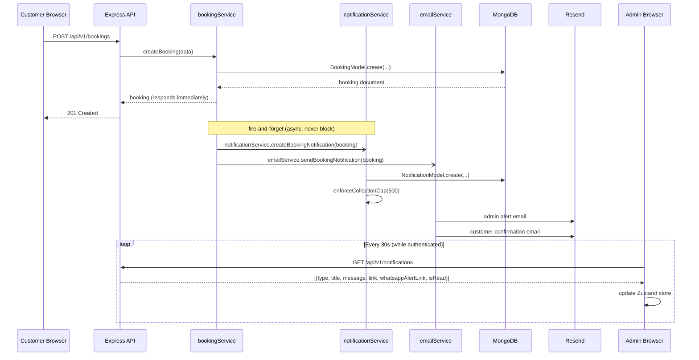

# Design Document

## Booking Notification & CRM System
### Shree Ganesh Party Venue & Catering Service

---

## Overview

This design extends the existing booking system with a three-channel notification pipeline and a lightweight CRM layer. When a customer submits a booking, three actions fire in parallel (fire-and-forget from `bookingService.createBooking`): an admin alert email via Resend, a customer auto-reply confirmation email, and a persisted in-app notification record that includes a WhatsApp deep-link for the admin. The frontend gains a polling-based notification bell, enriched bookings list, and a contact panel on the booking detail page.

**Design constraints:**
- All notification side-effects are non-blocking — they must never delay the HTTP response to the customer.
- The `Booking` model and its state machine already exist; this design extends, not replaces, that code.
- Polling is client-side only (no WebSocket, no SSE) — 30-second interval via `setInterval`, gated on auth.
- WhatsApp functionality degrades gracefully when `ADMIN_WHATSAPP_NUMBER` is not configured.

---

## Architecture



---

## Components and Interfaces

### Backend — New Files

| File | Responsibility |
|---|---|
| `server/src/models/Notification.ts` | Mongoose model + TTL/cap indexes |
| `server/src/services/notificationService.ts` | Create notifications, generate WhatsApp links, enforce 500-record cap |
| `server/src/controllers/notificationController.ts` | Express handlers for the 3 notification endpoints |
| `server/src/routes/notificationRoutes.ts` | Route registration; all routes are `adminOnly` |
| `server/src/validators/notificationSchema.ts` | Zod schema for the `:id/read` param |

### Backend — Modified Files

| File | Change |
|---|---|
| `server/src/config/env.ts` | Add optional `ADMIN_WHATSAPP_NUMBER` with Nepal regex + startup warning |
| `server/src/services/bookingService.ts` | Add fire-and-forget call to `notificationService.createBookingNotification` in `createBooking` |
| `server/src/services/emailService.ts` | Fix customer email subject; fix admin CTA link to use `bookingId` detail URL; fix customer CTA to `/contact`; conditional notes rendering |
| `server/src/app.ts` (or main router) | Mount `notificationRoutes` at `/api/v1/notifications` |

### Frontend — New Files

| File | Responsibility |
|---|---|
| `client/src/hooks/useNotificationPolling.ts` | Custom hook encapsulating polling lifecycle (start/stop on auth change) |

### Frontend — Modified Files

| File | Change |
|---|---|
| `client/src/store/notificationStore.ts` | Add `title`, `whatsappAlertLink`, `isRead` fields to `Notification` type; add `setNotifications`, `markOneRead` actions |
| `client/src/components/shared/NotificationDropdown.tsx` | Integrate `useNotificationPolling`; add WhatsApp button; add `isRead` visual dimming |
| `client/src/pages/admin/BookingsPage.tsx` | Add Actions column, source tag, total count, pending row highlight, pagination reset |
| `client/src/pages/admin/BookingDetailPage.tsx` | Add "Contact Customer" section with Call/WhatsApp/Email buttons above status panel |
| `client/src/types/index.ts` | Add `Notification` interface |

---

## Data Models

### Notification Model (`server/src/models/Notification.ts`)

```typescript
import mongoose, { Schema, Document } from 'mongoose';

export type NotificationType = 'booking' | 'inquiry';

export interface INotification extends Document {
  type: NotificationType;
  title: string;
  message: string;
  link: string;
  whatsappAlertLink?: string;
  isRead: boolean;
  createdAt: Date;
}

const NotificationSchema = new Schema<INotification>(
  {
    type:               { type: String, enum: ['booking', 'inquiry'], required: true },
    title:              { type: String, required: true },
    message:            { type: String, required: true },
    link:               { type: String, required: true },
    whatsappAlertLink:  { type: String },
    isRead:             { type: Boolean, default: false },
    createdAt:          { type: Date, default: Date.now },
  },
  { timestamps: false },   // createdAt managed manually for TTL
);

// TTL — auto-delete records older than 90 days
NotificationSchema.index(
  { createdAt: 1 },
  { expireAfterSeconds: 7776000, name: 'ttl_createdAt' },
);

// Fast unread queries
NotificationSchema.index({ isRead: 1 }, { name: 'idx_isRead' });
NotificationSchema.index({ isRead: 1, createdAt: -1 }, { name: 'idx_isRead_createdAt' });

export const NotificationModel =
  (mongoose.models.Notification as mongoose.Model<INotification>) ||
  mongoose.model<INotification>('Notification', NotificationSchema);
```

**Key design decisions:**
- `timestamps: false` because we set `createdAt` explicitly — the TTL index needs the field name to match exactly.
- The 90-day TTL is the authoritative cleanup; the 500-record cap is a soft guard enforced in application code.
- `whatsappAlertLink` is optional because it is absent when `ADMIN_WHATSAPP_NUMBER` is not configured.

### Booking Model — No Changes Required

The existing `Booking` model already has all required fields (`status`, `source`, `statusHistory`, `phone`, `email`). No schema migration needed.

### Frontend `Notification` Type (`client/src/types/index.ts`)

```typescript
export interface Notification {
  _id: string;            // MongoDB _id from API (maps to store id)
  type: 'booking' | 'inquiry';
  title: string;
  message: string;
  link: string;
  whatsappAlertLink?: string;
  isRead: boolean;
  createdAt: string;      // ISO string from API
}
```

---
