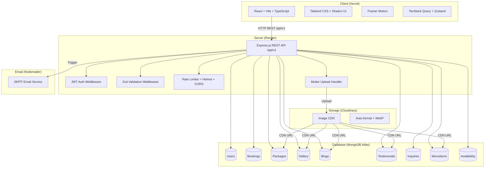
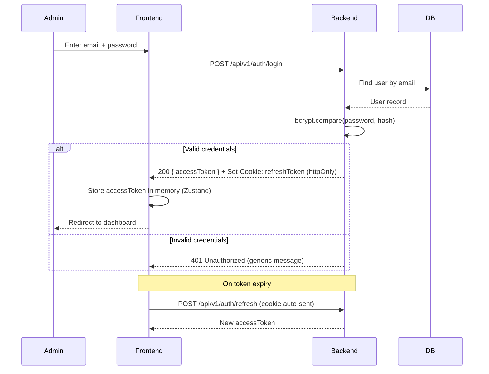
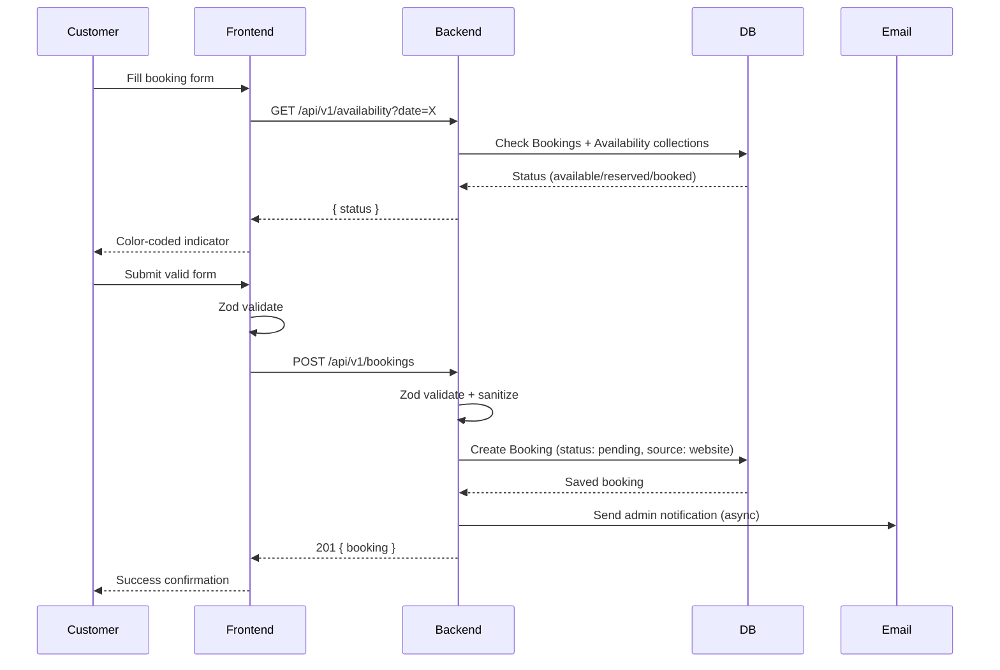
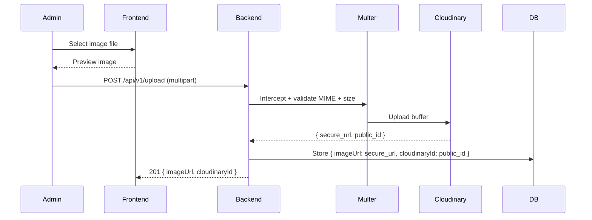

# Design Document

## Shree Ganesh Party Venue & Catering Service

---

## Overview

Shree Ganesh Party Venue & Catering Service is a full production-grade MERN stack platform for a premium event venue and catering business located in Bhaktapur, Nepal. The platform serves simultaneously as a lead-generation system, booking engine, media showcase, content marketing hub, and operations management tool.

The system comprises two primary surfaces:

1. **Public Marketing Website** — A premium, conversion-optimized, SEO-friendly website accessible to all visitors. It includes nine public pages (Home, About, Services, Gallery, Packages, Menu, Blog, Contact, Booking), an inline availability checker, and a client-side event cost calculator.

2. **Admin Dashboard** — A JWT-protected management interface for super-admins, admins, and editors to manage bookings, gallery, packages, blog posts, testimonials, inquiries, menus, and the availability calendar.

The primary business goal is converting website visitors into qualified booking inquiries. All design decisions are oriented toward trust-building, fast performance, strong local SEO, and frictionless booking UX.

**Key Design Decisions:**
- REST API at `/api/v1` with versioning to allow future extension without breaking clients
- MongoDB Atlas chosen for its schema flexibility (varied event types, dynamic package features) and managed cloud hosting
- Cloudinary chosen for media storage so images are optimized, transformed, and globally CDN-delivered without backend storage
- Zustand + TanStack Query chosen for frontend state: Zustand handles auth/UI global state, React Query handles all server-state caching and invalidation
- JWT with HTTP-only refresh token cookies prevents XSS-based token theft while enabling seamless session renewal
- Zod validation on both frontend (form schemas) and backend (request schemas) ensuring a single source of truth for validation rules


---

## Architecture

### System Architecture Diagram




### Authentication Flow



### Booking Flow



### Image Upload Flow




### Deployment Architecture

```
GitHub Repository
├── /client  ──────► Vercel (React SPA)
└── /server  ──────► Render (Node.js API)
                          │
                          ├──► MongoDB Atlas (Database)
                          └──► Cloudinary (Media CDN)
```

**Environment Variables:**

Frontend (Vite):
- `VITE_API_URL` — Backend API base URL
- `VITE_CLOUDINARY_NAME` — Cloudinary cloud name for direct transforms
- `VITE_GOOGLE_MAPS_KEY` — Embedded map API key

Backend (Node/Express):
- `PORT`, `NODE_ENV`, `MONGODB_URI`
- `JWT_SECRET`, `JWT_REFRESH_SECRET`, `JWT_EXPIRES_IN`, `JWT_REFRESH_EXPIRES_IN`
- `CLOUDINARY_NAME`, `CLOUDINARY_KEY`, `CLOUDINARY_SECRET`
- `EMAIL_USER`, `EMAIL_PASSWORD`, `EMAIL_TO`
- `FRONTEND_URL` (CORS origin), `RATE_LIMIT_WINDOW_MS`, `RATE_LIMIT_MAX`

---

## Components and Interfaces

### Frontend Project Structure

```
src/
├── app/                    # App root, providers, global config
├── assets/                 # Static images, icons, fonts
├── components/
│   ├── ui/                 # Shadcn UI primitives (Button, Input, Modal, etc.)
│   ├── layout/             # Header, Footer, AdminLayout, PublicLayout
│   ├── sections/           # Page-level section components (HeroSection, ServicesSection)
│   ├── forms/              # BookingForm, ContactForm, LoginForm, PackageForm
│   └── shared/             # WhatsAppButton, SEOHead, SkeletonLoader, Lightbox
├── pages/
│   ├── Home/               # HomePage.tsx
│   ├── About/              # AboutPage.tsx
│   ├── Services/           # ServicesPage.tsx
│   ├── Gallery/            # GalleryPage.tsx
│   ├── Packages/           # PackagesPage.tsx
│   ├── Menu/               # MenuPage.tsx
│   ├── Blog/               # BlogListPage.tsx, BlogDetailPage.tsx
│   ├── Contact/            # ContactPage.tsx
│   ├── Booking/            # BookingPage.tsx
│   └── Admin/              # Dashboard, Bookings, Gallery, Packages, Blogs, etc.
├── hooks/                  # useBookings, useGallery, useAuth, useAvailability
├── services/               # bookingService, authService, galleryService (Axios)
├── store/                  # authStore.ts (Zustand), notificationStore.ts
├── lib/                    # axiosInstance.ts, queryClient.ts
├── types/                  # Booking.ts, Package.ts, Gallery.ts, Blog.ts, etc.
├── constants/              # EVENT_TYPES, PACKAGE_CATEGORIES, GALLERY_CATEGORIES
├── routes/                 # router.tsx (React Router v6, lazy-loaded)
└── utils/                  # formatDate, slugify, calculateEventCost, cn
```


### Backend Project Structure

```
server/
├── config/
│   ├── db.ts               # MongoDB Atlas connection
│   ├── cloudinary.ts       # Cloudinary SDK config
│   └── env.ts              # Validated env variables
├── controllers/
│   ├── authController.ts
│   ├── bookingController.ts
│   ├── packageController.ts
│   ├── galleryController.ts
│   ├── blogController.ts
│   ├── testimonialController.ts
│   ├── inquiryController.ts
│   ├── menuController.ts
│   ├── availabilityController.ts
│   └── dashboardController.ts
├── services/
│   ├── bookingService.ts   # Business logic for booking creation/status
│   ├── galleryService.ts   # Cloudinary upload/delete orchestration
│   ├── blogService.ts      # Blog CRUD + slug generation
│   ├── emailService.ts     # Nodemailer send functions
│   └── availabilityService.ts
├── routes/
│   ├── authRoutes.ts
│   ├── bookingRoutes.ts
│   ├── packageRoutes.ts
│   ├── galleryRoutes.ts
│   ├── blogRoutes.ts
│   ├── testimonialRoutes.ts
│   ├── inquiryRoutes.ts
│   ├── menuRoutes.ts
│   ├── availabilityRoutes.ts
│   └── dashboardRoutes.ts
├── models/
│   ├── User.ts
│   ├── Booking.ts
│   ├── Package.ts
│   ├── Gallery.ts
│   ├── Blog.ts
│   ├── Testimonial.ts
│   ├── Inquiry.ts
│   ├── MenuItem.ts
│   └── Availability.ts
├── middleware/
│   ├── authMiddleware.ts   # JWT verify + attach req.user
│   ├── roleMiddleware.ts   # RBAC role check
│   ├── errorMiddleware.ts  # Global error handler
│   ├── uploadMiddleware.ts # Multer config (memoryStorage)
│   └── rateLimiter.ts      # express-rate-limit configs
├── validators/
│   ├── bookingSchema.ts    # Zod schemas
│   ├── authSchema.ts
│   ├── packageSchema.ts
│   ├── blogSchema.ts
│   ├── testimonialSchema.ts
│   ├── inquirySchema.ts
│   └── menuSchema.ts
├── utils/
│   ├── slugify.ts
│   ├── generateBookingId.ts
│   ├── apiResponse.ts      # Standardized response helpers
│   └── logger.ts
└── app.ts                  # Express app setup (Helmet, CORS, routes)
```


### Key Frontend Interfaces (TypeScript)

```typescript
// types/Booking.ts
export interface Booking {
  _id: string;
  bookingId: string;
  customerName: string;
  email: string;
  phone: string;
  eventType: EventType;
  eventDate: string;       // ISO 8601
  guestCount: number;
  packageId?: string;
  cateringRequired: boolean;
  decorationRequired: boolean;
  notes?: string;
  estimatedPrice?: number;
  status: BookingStatus;
  source: BookingSource;
  createdAt: string;
  updatedAt: string;
}

export type EventType = 'Wedding' | 'Reception' | 'Birthday' | 'Bratabandha' | 'Pasni' | 'Corporate' | 'Catering' | 'Decoration' | 'Other';
export type BookingStatus = 'pending' | 'contacted' | 'confirmed' | 'completed' | 'cancelled';
export type BookingSource = 'website' | 'whatsapp' | 'phone' | 'referral';

// types/Package.ts
export interface Package {
  _id: string;
  name: string;
  slug: string;
  description: string;
  category: 'silver' | 'gold' | 'platinum' | 'custom';
  price: number;
  capacity: number;
  features: string[];
  image?: string;
  isPopular: boolean;
  isActive: boolean;
}

// types/Gallery.ts
export interface GalleryImage {
  _id: string;
  title?: string;
  imageUrl: string;
  cloudinaryId: string;
  category: GalleryCategory;
  altText?: string;
  featured: boolean;
}
export type GalleryCategory = 'wedding' | 'reception' | 'birthday' | 'catering' | 'decoration' | 'venue';

// types/Blog.ts
export interface Blog {
  _id: string;
  title: string;
  slug: string;
  excerpt: string;
  content: string;
  featuredImage: string;
  category: string;
  tags: string[];
  author: string;
  seoTitle: string;
  seoDescription: string;
  published: boolean;
  views: number;
  createdAt: string;
}

// types/Availability.ts
export type AvailabilityStatus = 'available' | 'reserved' | 'booked';
export interface AvailabilityResponse {
  date: string;
  status: AvailabilityStatus;
}

// types/ApiResponse.ts
export interface ApiResponse<T> {
  success: boolean;
  message: string;
  data: T;
}
export interface PaginatedApiResponse<T> extends ApiResponse<T[]> {
  pagination: { page: number; limit: number; total: number; pages: number };
}
```

### Event Cost Calculator Logic

The calculator is a pure client-side function — no API call required:

```typescript
// utils/calculateEventCost.ts
export interface CalculatorInput {
  eventType: EventType;
  guestCount: number;
  selectedPackage: Package;
}
export interface CalculatorResult {
  basePrice: number;
  estimatedMin: number;
  estimatedMax: number;
  capacityWarning: boolean;
  perHeadRate: number;
}

export function calculateEventCost(input: CalculatorInput): CalculatorResult {
  const { guestCount, selectedPackage } = input;
  const perHeadRate = selectedPackage.price / selectedPackage.capacity;
  const estimatedMin = Math.round(perHeadRate * guestCount * 0.9);
  const estimatedMax = Math.round(perHeadRate * guestCount * 1.1);
  return {
    basePrice: selectedPackage.price,
    estimatedMin,
    estimatedMax,
    capacityWarning: guestCount > selectedPackage.capacity,
    perHeadRate,
  };
}
```


### API Endpoint Summary

| Method | Endpoint | Auth | Description |
|--------|----------|------|-------------|
| POST | `/api/v1/auth/login` | Public | Admin login |
| POST | `/api/v1/auth/logout` | Admin | Logout + invalidate refresh token |
| POST | `/api/v1/auth/refresh` | Cookie | Refresh access token |
| GET | `/api/v1/auth/me` | Admin | Get current user |
| GET | `/api/v1/bookings` | Admin | List bookings (paginated, filterable) |
| POST | `/api/v1/bookings` | Public | Submit booking inquiry |
| GET | `/api/v1/bookings/:id` | Admin | Get booking detail |
| PATCH | `/api/v1/bookings/:id/status` | Admin | Update booking status |
| DELETE | `/api/v1/bookings/:id` | Admin | Delete booking |
| GET | `/api/v1/packages` | Public | List active packages |
| GET | `/api/v1/packages/:slug` | Public | Get package by slug |
| POST | `/api/v1/packages` | Admin | Create package |
| PUT | `/api/v1/packages/:id` | Admin | Update package |
| DELETE | `/api/v1/packages/:id` | Admin | Delete package (conflict check) |
| GET | `/api/v1/gallery` | Public | List gallery images (filterable by category) |
| POST | `/api/v1/gallery` | Admin | Upload gallery image |
| DELETE | `/api/v1/gallery/:id` | Admin | Delete gallery image |
| GET | `/api/v1/blogs` | Public | List published blogs |
| GET | `/api/v1/blogs/:slug` | Public | Get blog by slug |
| POST | `/api/v1/blogs` | Admin | Create blog |
| PUT | `/api/v1/blogs/:id` | Admin | Update blog |
| DELETE | `/api/v1/blogs/:id` | Admin | Delete blog |
| GET | `/api/v1/testimonials` | Public | List featured testimonials |
| POST | `/api/v1/testimonials` | Admin | Create testimonial |
| PUT | `/api/v1/testimonials/:id` | Admin | Update testimonial |
| DELETE | `/api/v1/testimonials/:id` | Admin | Delete testimonial |
| GET | `/api/v1/menu` | Public | List available menu items |
| POST | `/api/v1/menu` | Admin | Create menu item |
| PUT | `/api/v1/menu/:id` | Admin | Update menu item |
| DELETE | `/api/v1/menu/:id` | Admin | Delete menu item |
| POST | `/api/v1/inquiries` | Public | Submit contact inquiry |
| GET | `/api/v1/inquiries` | Admin | List inquiries (filterable by status) |
| PATCH | `/api/v1/inquiries/:id` | Admin | Update inquiry status |
| DELETE | `/api/v1/inquiries/:id` | Admin | Delete inquiry |
| GET | `/api/v1/availability` | Public | Check date availability (`?date=YYYY-MM-DD`) |
| POST | `/api/v1/availability/block` | Admin | Block a date manually |
| GET | `/api/v1/dashboard/overview` | Admin | Aggregated metrics |
| POST | `/api/v1/upload` | Admin | Generic image upload to Cloudinary |


---

## Data Models

### User Model

```typescript
// models/User.ts
const UserSchema = new Schema({
  name:       { type: String, required: true, trim: true },
  email:      { type: String, required: true, unique: true, lowercase: true },
  password:   { type: String, required: true },            // bcrypt hash, minRounds: 10
  role:       { type: String, enum: ['super-admin', 'admin', 'editor'], default: 'admin' },
  avatar:     { type: String },
  isActive:   { type: Boolean, default: true },
  lastLogin:  { type: Date },
  refreshToken: { type: String },                          // stored for invalidation on logout
}, { timestamps: true });

UserSchema.index({ email: 1 }, { unique: true });
```

### Booking Model

```typescript
// models/Booking.ts
const BookingSchema = new Schema({
  bookingId:           { type: String, required: true, unique: true },  // e.g. SGP-20260820-0001
  customerName:        { type: String, required: true, trim: true },
  email:               { type: String, required: true, lowercase: true },
  phone:               { type: String, required: true },
  eventType:           { type: String, required: true, enum: EVENT_TYPES },
  eventDate:           { type: Date, required: true },
  guestCount:          { type: Number, required: true, min: 1 },
  packageId:           { type: Schema.Types.ObjectId, ref: 'Package' },
  cateringRequired:    { type: Boolean, default: false },
  decorationRequired:  { type: Boolean, default: false },
  notes:               { type: String, maxlength: 1000 },
  estimatedPrice:      { type: Number },
  status:              { type: String, enum: BOOKING_STATUSES, default: 'pending' },
  source:              { type: String, enum: BOOKING_SOURCES, default: 'website' },
  statusHistory:       [{ status: String, changedAt: Date, changedBy: String }],
}, { timestamps: true });

BookingSchema.index({ eventDate: 1 });
BookingSchema.index({ status: 1 });
BookingSchema.index({ createdAt: -1 });
BookingSchema.index({ customerName: 'text', phone: 'text' });
```

### Package Model

```typescript
// models/Package.ts
const PackageSchema = new Schema({
  name:        { type: String, required: true, trim: true },
  slug:        { type: String, required: true, unique: true },
  description: { type: String, required: true },
  category:    { type: String, enum: ['silver', 'gold', 'platinum', 'custom'], required: true },
  price:       { type: Number, required: true, min: 0 },
  capacity:    { type: Number, required: true, min: 1 },
  features:    { type: [String], validate: [(v: string[]) => v.length > 0, 'At least one feature required'] },
  image:       { type: String },
  isPopular:   { type: Boolean, default: false },
  isActive:    { type: Boolean, default: true },
}, { timestamps: true });

PackageSchema.index({ slug: 1 }, { unique: true });
PackageSchema.index({ isActive: 1 });
```


### Gallery Model

```typescript
// models/Gallery.ts
const GallerySchema = new Schema({
  title:        { type: String, trim: true },
  imageUrl:     { type: String, required: true },
  cloudinaryId: { type: String, required: true },
  category:     { type: String, required: true, enum: GALLERY_CATEGORIES },
  eventType:    { type: String },
  altText:      { type: String },
  featured:     { type: Boolean, default: false },
}, { timestamps: true });

GallerySchema.index({ category: 1 });
GallerySchema.index({ featured: 1 });
```

### Blog Model

```typescript
// models/Blog.ts
const BlogSchema = new Schema({
  title:          { type: String, required: true, trim: true },
  slug:           { type: String, required: true, unique: true },
  excerpt:        { type: String, required: true, maxlength: 300 },
  content:        { type: String, required: true },
  featuredImage:  { type: String, required: true },
  category:       { type: String, required: true },
  tags:           { type: [String], default: [] },
  author:         { type: String, required: true },
  seoTitle:       { type: String, maxlength: 60 },
  seoDescription: { type: String, maxlength: 160 },
  published:      { type: Boolean, default: false },
  publishedAt:    { type: Date },
  views:          { type: Number, default: 0 },
}, { timestamps: true });

BlogSchema.index({ slug: 1 }, { unique: true });
BlogSchema.index({ published: 1, createdAt: -1 });
BlogSchema.index({ title: 'text', tags: 'text' });
```

### Testimonial Model

```typescript
// models/Testimonial.ts
const TestimonialSchema = new Schema({
  customerName: { type: String, required: true, trim: true },
  designation:  { type: String },
  rating:       { type: Number, required: true, min: 1, max: 5, validate: Number.isInteger },
  review:       { type: String, required: true },
  image:        { type: String },
  cloudinaryId: { type: String },
  featured:     { type: Boolean, default: false },
}, { timestamps: true });

TestimonialSchema.index({ featured: 1 });
```

### Inquiry Model

```typescript
// models/Inquiry.ts
const InquirySchema = new Schema({
  name:    { type: String, required: true, trim: true },
  email:   { type: String, required: true, lowercase: true },
  phone:   { type: String, required: true },
  subject: { type: String },
  message: { type: String, required: true },
  status:  { type: String, enum: ['unread', 'read', 'replied'], default: 'unread' },
}, { timestamps: true });

InquirySchema.index({ status: 1 });
InquirySchema.index({ createdAt: -1 });
```

### MenuItem Model

```typescript
// models/MenuItem.ts
const MenuItemSchema = new Schema({
  name:        { type: String, required: true, trim: true },
  description: { type: String },
  category:    { type: String, required: true, enum: MENU_CATEGORIES },
  image:       { type: String },
  cloudinaryId:{ type: String },
  price:       { type: Number },
  available:   { type: Boolean, default: true },
}, { timestamps: true });

MenuItemSchema.index({ category: 1 });
MenuItemSchema.index({ available: 1 });
```

### Availability Model

```typescript
// models/Availability.ts
const AvailabilitySchema = new Schema({
  date:      { type: Date, required: true, unique: true },
  bookingId: { type: Schema.Types.ObjectId, ref: 'Booking' },
  status:    { type: String, enum: ['available', 'reserved', 'booked'], required: true },
  blockedBy: { type: Schema.Types.ObjectId, ref: 'User' },  // for manually blocked dates
}, { timestamps: true });

AvailabilitySchema.index({ date: 1 }, { unique: true });
```

### Collection Relationships

```
User ──── (author) ──► Blog
Package ─(ref)─► Booking (packageId)
Booking ─(bookingId)─► Availability
User ─(blockedBy)─► Availability
```

The `statusHistory` subdocument array in `Booking` enables full audit trails without a separate collection, satisfying the admin communication log requirement.


---

## Correctness Properties

*A property is a characteristic or behavior that should hold true across all valid executions of a system — essentially, a formal statement about what the system should do. Properties serve as the bridge between human-readable specifications and machine-verifiable correctness guarantees.*

The following properties are derived from the acceptance criteria prework analysis. They are universally quantified statements that will be verified using property-based testing with [fast-check](https://fast-check.dev/) (TypeScript PBT library) on the backend service layer and frontend utility functions. Each property test runs a minimum of 100 iterations.

**Property Reflection:** Before listing properties, the following consolidations were applied to eliminate redundancy:
- Requirements 2.5 and 2.12 (booking creation stores correct status and source) are combined into one round-trip property (Property 1).
- Requirements 2.8, 3.1, and 3.2 (availability response is always a valid enum, confirmed/pending dates are not available) are combined into two focused properties (Properties 2 and 3).
- Requirements 4.2 and 4.3 (cost calculator output) are combined into one property (Property 4).
- Requirements 8.1, 8.5, and 10.10 (blog rendering and SEO meta tags) are combined (Property 9).
- Requirements 11.7 and 22.9 (bcrypt cost factor) are one property (Property 12).
- Requirements 22.6 and 22.7 (Zod validation + 400 response) are combined (Property 16).
- Requirements 23.2, 23.3, and 14.3, 14.4 (upload validation) are combined (Property 17).

---

### Property 1: Booking creation round-trip preserves status and source

*For any* valid booking payload submitted via `POST /api/v1/bookings`, the stored booking record SHALL have `status` equal to `"pending"` and `source` equal to `"website"`, and the `bookingId` field SHALL be a non-empty string with the format `SGP-{date}-{sequence}`.

**Validates: Requirements 2.5, 2.12**

---

### Property 2: Availability response is always a valid status enum

*For any* date passed to `GET /api/v1/availability?date=X`, the API response `status` field SHALL be exactly one of `"available"`, `"reserved"`, or `"booked"` — never null, undefined, or any other value.

**Validates: Requirements 3.1**

---

### Property 3: Confirmed and pending bookings mark their dates as non-available

*For any* booking with `status` of `"confirmed"` or `"pending"` stored in the database, a subsequent availability query for that booking's `eventDate` SHALL NOT return `"available"`.

**Validates: Requirements 3.2, 20.3**

---

### Property 4: Event cost calculator produces a valid positive estimate for any valid input

*For any* valid combination of `eventType`, `guestCount` (≥ 1), and `Package` (with valid `price` and `capacity` > 0), the `calculateEventCost` function SHALL return an `estimatedMin` and `estimatedMax` that are both positive numbers, and `estimatedMin` SHALL be less than or equal to `estimatedMax`.

**Validates: Requirements 4.2, 4.3**

---

### Property 5: Gallery category filter returns only matching items

*For any* list of gallery images stored in the database and any valid category string, `GET /api/v1/gallery?category={C}` SHALL return only images where `category` equals `C`. No image with a different category SHALL appear in the response.

**Validates: Requirements 5.2, 5.3, 5.7**

---

### Property 6: Package render includes all required fields

*For any* active package record stored in the database, the API response object for that package SHALL contain non-empty values for `name`, `price`, `capacity`, `features` (with at least one element), and a `slug`.

**Validates: Requirements 6.2, 15.2**

---

### Property 7: Popular badge appears on exactly the packages marked isPopular

*For any* list of packages returned by `GET /api/v1/packages`, the packages with `isPopular: true` SHALL each have `isPopular: true` in the response, and packages with `isPopular: false` SHALL NOT have `isPopular: true`. The popular state is preserved exactly through the full storage and retrieval round-trip.

**Validates: Requirements 6.3**

---

### Property 8: Only active packages are returned by the public packages endpoint

*For any* set of packages in the database with mixed `isActive` values, `GET /api/v1/packages` SHALL return only packages where `isActive` is `true`. No inactive package SHALL appear in the public response.

**Validates: Requirements 6.6, 15.5**

---

### Property 9: Blog detail page SEO meta tags match the stored blog's seoTitle and seoDescription

*For any* published blog record with a non-empty `seoTitle` and `seoDescription`, fetching `GET /api/v1/blogs/:slug` SHALL return an object where `seoTitle` and `seoDescription` exactly match the values stored in the database. The frontend `<head>` SHALL render those exact values as `<title>` and `<meta name="description">`.

**Validates: Requirements 8.5, 8.7, 10.10**

---

### Property 10: Only published blogs are returned by the public blog listing endpoint

*For any* set of blogs in the database with mixed `published` values, `GET /api/v1/blogs` SHALL return only blogs where `published` is `true`. No draft blog SHALL appear in the public listing response.

**Validates: Requirements 8.6, 16.5**

---

### Property 11: Inquiry creation always stores status as unread

*For any* valid inquiry payload submitted via `POST /api/v1/inquiries`, the stored inquiry record SHALL have `status` equal to `"unread"` immediately after creation.

**Validates: Requirements 9.3**

---

### Property 12: Admin passwords are always stored as bcrypt hashes with cost factor ≥ 10

*For any* admin user created in the system, the stored `password` field SHALL be a bcrypt hash string, `bcrypt.compare(plaintext, hash)` SHALL return `true` for the original password, and `bcrypt.getRounds(hash)` SHALL return a value ≥ 10.

**Validates: Requirements 11.7, 22.9**

---

### Property 13: RBAC — editor role is denied access to admin-only endpoints

*For any* JWT issued to a user with `role: "editor"`, requests to endpoints restricted to `"admin"` or `"super-admin"` (e.g., booking status update, package create/delete) SHALL receive a `403 Forbidden` response. Requests to `"editor"`-permitted endpoints SHALL receive a `200` response.

**Validates: Requirements 11.9**

---

### Property 14: Dashboard total bookings equals the sum of all status counts

*For any* state of the bookings collection, the `totalBookings` metric returned by `GET /api/v1/dashboard/overview` SHALL equal the sum of `pendingBookings + contactedBookings + confirmedBookings + completedBookings + cancelledBookings`.

**Validates: Requirements 12.1**

---

### Property 15: Booking status transitions follow the allowed state machine

*For any* booking in the system, the only valid status transitions are: `pending → contacted`, `contacted → confirmed`, `confirmed → completed`, `confirmed → cancelled`, `pending → cancelled`. Any attempt to set a status that violates this state machine SHALL be rejected with a `400` or `409` response.

**Validates: Requirements 13.7**

---

### Property 16: Zod validation rejects malformed request bodies with 400 and structured errors

*For any* request body that is missing a required field or contains an out-of-range value (e.g., `guestCount: 0`, `rating: 6`, empty required string), the API SHALL return HTTP `400` and a response body matching `{ success: false, message: string, errors: Array }` where `errors` is non-empty.

**Validates: Requirements 22.6, 22.7, 2.11, 17.5**

---

### Property 17: Image upload rejects invalid MIME types and oversized files

*For any* file upload where the MIME type is not `image/jpeg`, `image/png`, or `image/webp`, the API SHALL reject the request. *For any* file upload where the file size exceeds 10 MB, the API SHALL return a `422 Unprocessable Entity` response. Valid files with correct MIME types and size ≤ 10 MB SHALL succeed and return `imageUrl` and `cloudinaryId` in the response.

**Validates: Requirements 23.2, 23.3, 14.3, 14.4**

---

### Property 18: API success responses always conform to the standard envelope format

*For any* successful API request (2xx response), the response body SHALL match the structure `{ success: true, message: string, data: object|array }`. *For any* error API response (4xx/5xx), the response body SHALL match `{ success: false, message: string, errors: array }`.

**Validates: Requirements 24.2, 24.3**

---

### Property 19: Pagination response structure is always consistent

*For any* list endpoint called with `?page=P&limit=L` parameters, the response SHALL include a `pagination` object with `page` equal to P, `limit` equal to L, `total` as a non-negative integer, and `pages` equal to `Math.ceil(total / L)`.

**Validates: Requirements 24.5**

---

### Property 20: Package slug auto-generation is URL-safe and derived from the name

*For any* package name string containing any combination of letters, numbers, spaces, and special characters, the auto-generated `slug` SHALL consist only of lowercase letters, digits, and hyphens. The slug SHALL be non-empty when the name is non-empty.

**Validates: Requirements 15.3, 16.3**

---

### Property 21: Referenced packages cannot be deleted (conflict protection)

*For any* Package that has at least one associated Booking referencing its `_id` as `packageId`, a `DELETE /api/v1/packages/:id` request SHALL receive a `409 Conflict` response and the package SHALL remain in the database unchanged.

**Validates: Requirements 15.6**

---

### Property 22: Manually blocked dates return reserved status in availability queries

*For any* date that an admin has manually blocked via `POST /api/v1/availability/block`, subsequent calls to `GET /api/v1/availability?date=X` for that date SHALL return `status: "reserved"`.

**Validates: Requirements 20.4, 20.5**

---

### Property 23: Only available menu items are returned by the public menu endpoint

*For any* set of menu items with mixed `available` values, `GET /api/v1/menu` SHALL return only items where `available` is `true`. No unavailable item SHALL appear in the response.

**Validates: Requirements 7.5, 19.3**

---

### Property 24: Email notification failure does not block booking or inquiry creation

*For any* valid booking or inquiry submission where the Nodemailer send operation throws an error, the API SHALL still return a `201 Created` response to the client with the created record. The email failure SHALL be logged server-side only.

**Validates: Requirements 21.5**


---

## Error Handling

### Backend Error Handling Strategy

All errors are funneled through a centralized Express error middleware (`errorMiddleware.ts`). Controllers never directly return error responses — they throw typed errors caught by the global handler.

```typescript
// utils/AppError.ts
export class AppError extends Error {
  statusCode: number;
  isOperational: boolean;
  constructor(message: string, statusCode: number) {
    super(message);
    this.statusCode = statusCode;
    this.isOperational = true;
  }
}

// middleware/errorMiddleware.ts
export const globalErrorHandler: ErrorRequestHandler = (err, req, res, next) => {
  if (err instanceof AppError) {
    return res.status(err.statusCode).json({
      success: false,
      message: err.message,
      errors: [],
    });
  }
  // Zod validation errors
  if (err instanceof ZodError) {
    return res.status(400).json({
      success: false,
      message: 'Validation failed',
      errors: err.errors.map(e => ({ field: e.path.join('.'), message: e.message })),
    });
  }
  // Mongoose duplicate key
  if (err.code === 11000) {
    const field = Object.keys(err.keyValue)[0];
    return res.status(409).json({ success: false, message: `${field} already exists`, errors: [] });
  }
  // Never expose stack traces in production
  logger.error(err);
  return res.status(500).json({ success: false, message: 'Internal server error', errors: [] });
};
```

### Error Scenarios and Handling

| Scenario | HTTP Status | Response |
|----------|-------------|----------|
| Missing required field | 400 | `errors[]` with field path |
| Invalid enum value | 400 | `errors[]` with allowed values |
| Guest count < 1 | 400 | Validation error |
| Unauthenticated request to protected route | 401 | Generic unauthorized message |
| Insufficient role (RBAC) | 403 | `"Access denied"` |
| Resource not found (booking, blog, package) | 404 | `"Resource not found"` |
| Delete package with existing bookings | 409 | `"Package has associated bookings"` |
| Duplicate slug/email | 409 | `"{field} already exists"` |
| Unsupported image MIME type | 422 | `"Unsupported file type"` |
| File size > 10 MB | 422 | `"File too large"` |
| Past date in availability check | 400 | `"Date must be in the future"` |
| Email notification failure | — | Logged, not propagated to client |
| Cloudinary upload failure | 500 | Internal error (logged) |
| MongoDB connection failure | 500 | Internal error (never expose URI) |

### Frontend Error Handling

- All API calls use a centralized `axiosInstance` with an interceptor that:
  - On 401: triggers silent refresh flow via `POST /api/v1/auth/refresh`
  - On 403: redirects to unauthorized page
  - On network error: displays toast `"Network error. Please check your connection."`
- React Query handles loading/error states; all data-fetching components display skeleton loaders during pending state and error UI on failure
- Forms use Zod schemas for client-side validation providing real-time field-level error messages before submission
- Toast notifications (Shadcn Toaster) display success/error feedback for all mutations


---

## Testing Strategy

### Overview

This platform uses a **dual testing approach**: example-based unit/integration tests for specific behaviors and infrastructure checks, and property-based tests for universal behavioral invariants across the business logic layer.

**PBT Applicability Assessment:** The backend service layer (booking creation, availability checks, cost calculation, validation, RBAC, slug generation, pagination) contains pure or near-pure functions with meaningful input variation. PBT is applicable. Infrastructure concerns (Cloudinary uploads, Nodemailer delivery, MongoDB Atlas connectivity) use integration tests with mocks.

### Testing Stack

| Layer | Tool | Purpose |
|-------|------|---------|
| Backend unit/PBT | Jest + fast-check | Service layer logic, validation |
| Backend integration | Jest + Supertest | API endpoints, DB operations |
| Frontend unit | Vitest + Testing Library | Component rendering, utility functions |
| Frontend PBT | fast-check (browser/node) | `calculateEventCost`, filter functions |
| E2E (optional) | Playwright | Critical user flows: booking, admin login |

### Property-Based Tests

Each property from the Correctness Properties section is implemented as a single PBT test. Configuration:
- Minimum **100 iterations** per property test
- Each test tagged with: `// Feature: shree-ganesh-party-venue, Property {N}: {title}`
- PBT library: [fast-check](https://fast-check.dev/) (`npm install --save-dev fast-check`)

**Example implementations:**

```typescript
// Property 4: Event cost calculator
// Feature: shree-ganesh-party-venue, Property 4: Cost calculator produces valid positive estimates
import * as fc from 'fast-check';
import { calculateEventCost } from '../utils/calculateEventCost';

test('Property 4: calculateEventCost returns valid positive estimates for any valid input', () => {
  fc.assert(
    fc.property(
      fc.integer({ min: 1, max: 5000 }),      // guestCount
      fc.float({ min: 1000, max: 10000000 }), // price
      fc.integer({ min: 1, max: 5000 }),      // capacity
      (guestCount, price, capacity) => {
        const pkg = { price, capacity, name: 'Test', slug: 'test', isActive: true } as any;
        const result = calculateEventCost({ eventType: 'Wedding', guestCount, selectedPackage: pkg });
        return (
          result.estimatedMin > 0 &&
          result.estimatedMax > 0 &&
          result.estimatedMin <= result.estimatedMax
        );
      }
    ),
    { numRuns: 100 }
  );
});

// Property 16: Zod validation rejects malformed booking bodies
// Feature: shree-ganesh-party-venue, Property 16: Validation rejects malformed requests with 400
import * as fc from 'fast-check';
import request from 'supertest';
import app from '../app';

test('Property 16: invalid guestCount is rejected with 400', async () => {
  await fc.assert(
    fc.asyncProperty(
      fc.integer({ max: 0 }), // guestCount ≤ 0
      async (guestCount) => {
        const res = await request(app)
          .post('/api/v1/bookings')
          .send({ customerName: 'Test', phone: '9800000000', email: 'test@test.com',
                  eventType: 'Wedding', eventDate: '2027-01-01', guestCount });
        return res.status === 400 && res.body.success === false && res.body.errors.length > 0;
      }
    ),
    { numRuns: 100 }
  );
});

// Property 20: Slug auto-generation is URL-safe
// Feature: shree-ganesh-party-venue, Property 20: Slug generation is URL-safe
import * as fc from 'fast-check';
import { slugify } from '../utils/slugify';

test('Property 20: generated slug contains only lowercase letters, digits, and hyphens', () => {
  fc.assert(
    fc.property(
      fc.string({ minLength: 1, maxLength: 100 }),
      (name) => {
        const slug = slugify(name);
        return slug.length > 0 && /^[a-z0-9-]+$/.test(slug);
      }
    ),
    { numRuns: 200 }
  );
});
```

### Unit / Integration Tests

**Backend unit tests** focus on:
- `bookingService.ts` — correct `bookingId` generation format, status transitions
- `availabilityService.ts` — date querying logic with mocked DB
- `emailService.ts` — correct invocation with mocked Nodemailer transport
- `authService.ts` — JWT signing/verification, bcrypt comparison

**Backend integration tests** (Supertest + test MongoDB):
- `POST /api/v1/bookings` — happy path, validation errors, duplicate date
- `POST /api/v1/auth/login` — correct credentials, wrong credentials, rate limit
- `GET /api/v1/packages` — only active packages returned
- `DELETE /api/v1/packages/:id` — conflict when bookings exist
- `PATCH /api/v1/bookings/:id/status` — invalid transitions rejected
- Image upload with mock Cloudinary (valid file, wrong MIME, oversized)

**Frontend unit tests** (Vitest + React Testing Library):
- `calculateEventCost` utility — boundary cases (guestCount=1, guestCount=capacity)
- `BookingForm` — renders all required fields, displays validation errors
- `GalleryPage` — category filter renders only matching images
- `BlogCard` — renders title, excerpt, category, date for any valid blog object
- `SEOHead` — correct meta tags injected for given props

### Smoke / Infrastructure Tests

- Public routes all resolve (9 pages render without console errors)
- `/sitemap.xml` returns 200 with valid XML containing all public pages
- `/robots.txt` returns 200 with `Disallow: /admin`
- Admin dashboard redirects unauthenticated users to `/admin/login`
- Lighthouse CI on Home page asserts score ≥ 90 (run in CI pipeline)

### Test File Locations

```
server/
└── __tests__/
    ├── unit/
    │   ├── bookingService.test.ts
    │   ├── availabilityService.test.ts
    │   ├── slugify.test.ts          ← PBT: Property 20
    │   ├── calculateCost.test.ts    ← PBT: Property 4
    │   └── authService.test.ts      ← PBT: Property 12
    └── integration/
        ├── booking.api.test.ts      ← PBT: Properties 1, 2, 3, 15, 16
        ├── packages.api.test.ts     ← PBT: Properties 6, 7, 8, 17, 21
        ├── gallery.api.test.ts      ← PBT: Properties 5, 17
        ├── blog.api.test.ts         ← PBT: Properties 9, 10, 20
        ├── auth.api.test.ts         ← PBT: Properties 12, 13
        ├── availability.api.test.ts ← PBT: Properties 2, 3, 22
        ├── dashboard.api.test.ts    ← PBT: Property 14
        ├── menu.api.test.ts         ← PBT: Property 23
        ├── inquiry.api.test.ts      ← PBT: Properties 11, 24
        └── api-format.test.ts       ← PBT: Properties 18, 19

client/
└── src/__tests__/
    ├── utils/calculateEventCost.test.ts  ← PBT: Property 4
    ├── components/BookingForm.test.tsx
    ├── components/GalleryPage.test.tsx   ← PBT: Property 5
    ├── components/BlogCard.test.tsx      ← PBT: Property 9
    └── components/PackageCard.test.tsx   ← PBT: Properties 6, 7, 8
```

